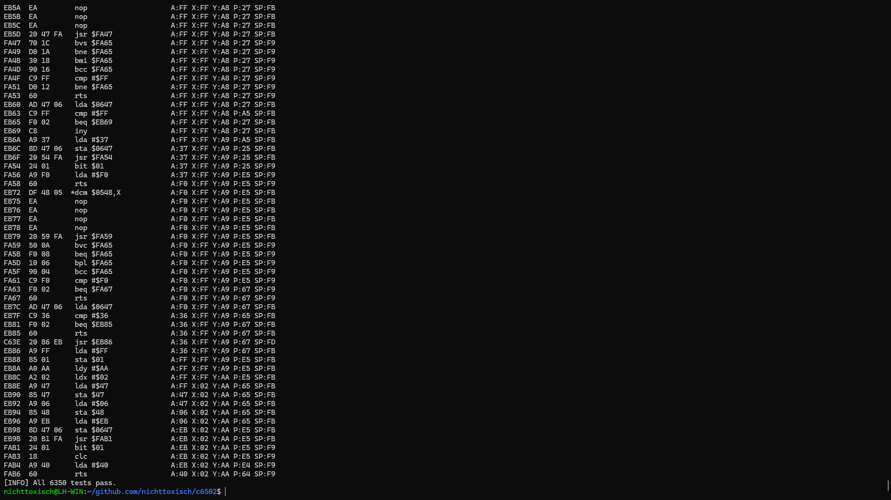
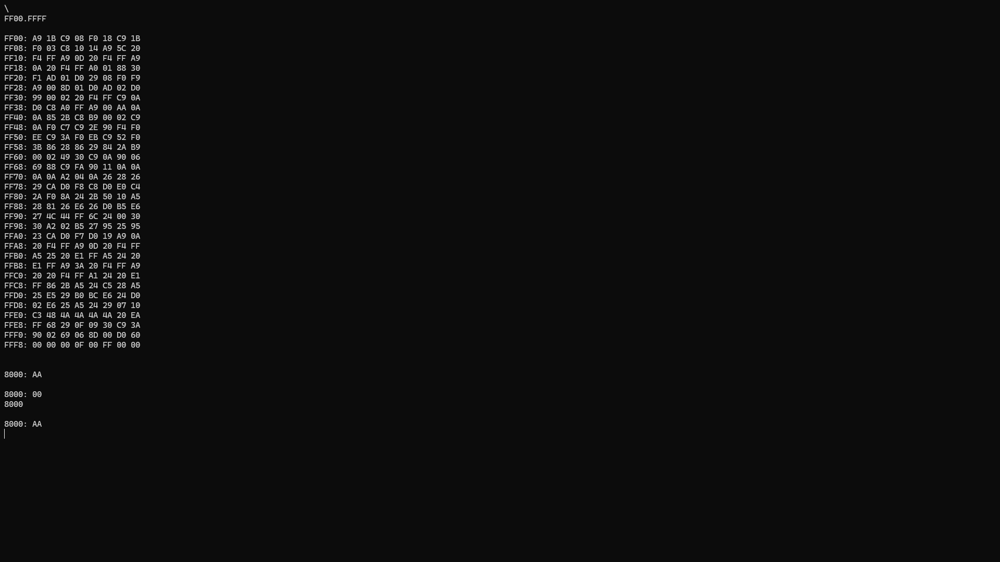
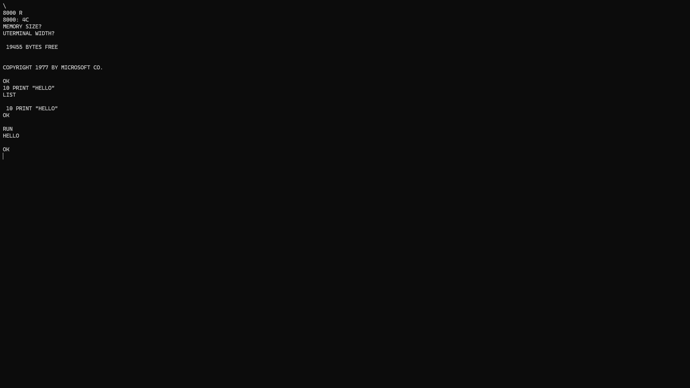

# 6502 Emulator
This 6502 Emulator implements the instruction set including come documented illegal opcodes (DCM, NOP, LAX, SAX). The motivation to program this project came from [Ben Eater](https://www.youtube.com/@BenEater) with his 6502 series. 

## Nestest
Using the [Nestest](http://nickmass.com/images/nestest.nes) program by kevtris, I could test the propper implementation of all instructions. The program [src/nestest.c](src/nestest.c) asserts a predefined internal state of the cpu after each instructions. The expected state is copied from this [log](tests/nestest_trace.txt) (In [tests/nestest.h](tests/nestest.h) each state is parsed to as struct) created using [Nintendulator](https://www.qmtpro.com/~nes/nintendulator/).

To run the tests use:
```console
make nestest
```

<p>

</p>


## Wozmon
Using the [WOZ Monitor](https://www.sbprojects.net/projects/apple1/wozmon.php) program designed for the Apple 1 by Steve Wozniak, we can examin and write to the memory. It is modified to allow user input and output from the console. 

To run wozmon use:
```console
make wozmon
```

<p>

</p>


## Microsoft Basic
To run MS Basic on the 6502 I modified the [Microsoft Basic for 6502](https://github.com/mist64/msbasic) source code. You need to implement a custom CHROUT and CHRIN routine. For this I uses the previously mentioned implemetation of Wozmon (A LOAD and SAVE routine is not supported). 

To run msbasic use:
```console
make msbasic
```


From there you start in Wozmon. From there type the following expression to enter MS Basic:
```console
8000 R
```

<p>

</p>


